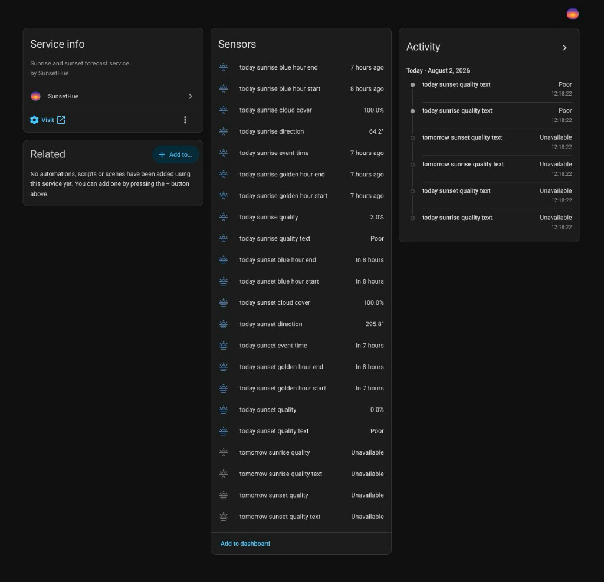

# SunsetHue

SunsetHue adds sunrise and sunset quality forecasts to Home Assistant using the
[SunsetHue developer API](https://sunsethue.com/dev-api). It provides quality
scores, cloud cover, event direction, event time, and blue/golden-hour
information for up to three local dates.

> This is an unofficial community integration and is not supported by
> Home Assistant or SunsetHue.

[](https://my.home-assistant.io/redirect/hacs_repository/?owner=andrewtryder&repository=ha-sunsethue&category=integration)



## Requirements

- Home Assistant 2026.3.0 or newer
- A SunsetHue API key from the [developer portal](https://sunsethue.com/dev-api/portal)
- [HACS](https://hacs.xyz/), or filesystem access for a manual install

## Installation

SunsetHue is a HACS custom integration (not an add-on).

### HACS

1. In HACS, add `https://github.com/andrewtryder/ha-sunsethue` as an Integration
   custom repository.
2. Install a numbered **SunsetHue** release (do not install `main` for normal
   use).
3. Restart Home Assistant.
4. Go to *Settings → Devices & services → Add integration*, search for
   **SunsetHue**, and complete setup.

HACS installs from the tagged repository source using the standard
`custom_components/sunsethue` layout.

### Manual installation

1. Copy `custom_components/sunsethue` from a release into
   `<config>/custom_components/sunsethue`.
2. Confirm `manifest.json` is at
   `<config>/custom_components/sunsethue/manifest.json`.
3. Restart Home Assistant.
4. Add the integration from *Settings → Devices & services → Add integration*.

## Configuration

When you add a location, provide:

- **Location name** — display name for this entry
- **API key** — from the SunsetHue developer portal
- **Latitude and longitude** — WGS84 decimal coordinates for the forecast site
- **Time zone** — IANA zone such as `America/New_York` (dates use this local time)
- **Initial forecast day** — which local date to start from

A **forecast day** is one local calendar date relative to the location's time
zone: **Today**, **Tomorrow**, or **Day after tomorrow**. New installations
request today's sunrise and sunset forecasts by default.

After setup, open the integration options to change:

- The first forecast day
- How many consecutive forecast days to request
- Whether sunrise, sunset, or both are enabled
- The refresh interval (6, 12, or 24 hours)
- Optional detailed entities

The consecutive-day count begins with the first forecast day and must stay
within today through the day after tomorrow. For example, starting tomorrow
with two consecutive days requests tomorrow and the day after tomorrow.

New installations default to:

- Today as the first forecast day
- One forecast date
- Sunrise and sunset enabled
- Two forecast API calls per refresh
- A six-hour refresh interval

Add a separate config entry for each location. Duplicate normalized coordinates
are rejected.

## Entities

| Entity | Default | Description |
| --- | --- | --- |
| Quality | Yes | Forecast quality as a percentage |
| Quality text | Yes | API description such as Poor or Excellent |
| Event time | Optional | Predicted sunrise or sunset time |
| Cloud cover | Optional | Forecast cloud-cover percentage |
| Direction | Optional | Event direction in degrees |
| Blue/golden-hour boundaries | Optional | Magic-hour start and end timestamps |

Quality sensors also expose forecast details as attributes (event time, cloud
cover, direction, magic-hour windows, and response metadata) when the API
supplies them. Optional detailed entities create separate sensors for those
values. Sensors become unavailable when that forecast field is missing; that is
expected when the API reports no model data for a date.

## API usage

Each coordinator refresh requests one SunsetHue `/event` call per selected
forecast date and enabled event type:

`selected dates × enabled event types = API calls per refresh`

Examples:

- Today, sunrise and sunset: **2** calls
- Today through day after tomorrow, sunrise and sunset: **6** calls
- One day, sunset only: **1** call

Setup validation uses one lightweight `forecast=false` request. Ongoing refresh
uses `forecast=true` so quality sensors receive model data. The integration also
refreshes shortly after each location's local midnight.

Current quota and pricing details are in the
[SunsetHue developer portal](https://sunsethue.com/dev-api/portal). See
[docs/api-contract.md](docs/api-contract.md) for the request and response
contract used by this integration.

## Dashboard and automations

- Dashboard card examples: [docs/dashboard-examples.md](docs/dashboard-examples.md)
- Automation examples: [docs/automation-examples.md](docs/automation-examples.md)
- Notification blueprint:
  [blueprints/automation/sunsethue/notify_sunset_quality_threshold.yaml](blueprints/automation/sunsethue/notify_sunset_quality_threshold.yaml)

[](https://my.home-assistant.io/redirect/blueprint_import/?blueprint_url=https://github.com/andrewtryder/ha-sunsethue/blob/main/blueprints/automation/sunsethue/notify_sunset_quality_threshold.yaml)

Minimal native dashboard example (replace the entity IDs):

```yaml
type: entities
title: Today's sunset forecast
entities:
  - entity: sensor.REPLACE_WITH_QUALITY_PERCENT_ENTITY
    name: Quality
  - entity: sensor.REPLACE_WITH_QUALITY_TEXT_ENTITY
    name: Description
  - type: attribute
    entity: sensor.REPLACE_WITH_QUALITY_PERCENT_ENTITY
    attribute: event_time
    name: Event time
```

## Troubleshooting

- Restart Home Assistant after installation before searching for the
  integration.
- Confirm the files live directly under `custom_components/sunsethue` (not a
  nested `sunsethue/sunsethue` folder).
- Check *Settings → System → Logs* for `sunsethue` load errors.
- Daily quota exhaustion is reported as a quota-specific error, separate from
  invalid coordinates or authentication failures.

Full guide: [docs/troubleshooting.md](docs/troubleshooting.md).

## Privacy and support

The API key is stored in the config entry and sent only as the documented
`x-api-key` HTTPS header. Diagnostics redact credentials and coordinates.
Download diagnostics from the integration page when opening an issue, and review
the file before sharing it.

Report defects on
[GitHub Issues](https://github.com/andrewtryder/ha-sunsethue/issues). Never
include an API key, exact address, or unreviewed diagnostics.

## Development

Contributor setup, tests, commits, and release process:
[CONTRIBUTING.md](CONTRIBUTING.md).

```bash
uv sync --group dev --locked
uv run pre-commit install
uv run python -m pytest
```
